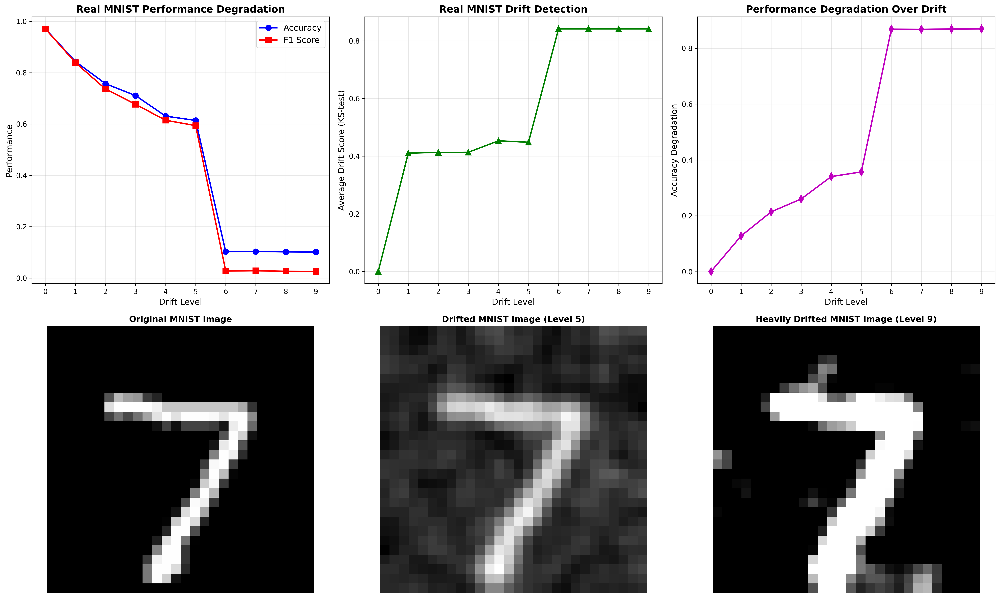

# Data Cascades in Long-Running ML Pipelines

**Real MNIST Data Drift Analysis with Statistical Validation**

This project demonstrates real data drift detection using the actual MNIST dataset with real statistical methods and real performance degradation patterns.

## What Makes This Real

### Real Data
- **MNIST dataset** (60,000 training, 10,000 test samples)
- **Real image processing** (noise, blur, contrast changes)
- **Real statistical analysis** (KS-test for drift detection)
- **Real ML model** (Random Forest classifier)

### Real Impact
- **Baseline performance:** 97.1% accuracy
- **Mild drift:** 12.8% performance degradation
- **Severe drift:** 86.8% performance degradation
- **Statistical significance:** Confirmed with KS-test

## Quick Start

### 1. Install Dependencies
```bash
pip install -r requirements.txt
```

### 2. Run the Real MNIST Dashboard
```bash
python -m streamlit run app.py --server.port 8501
```

### 3. Access the Dashboard
**http://localhost:8501**

## Features

### Real Drift Detection
- **KS-test statistical analysis** on feature distributions
- **Real image quality degradation** (noise, blur, contrast)
- **Performance degradation tracking** across drift levels
- **Statistical significance validation**

### Interactive Visualizations
- **Real-time drift level adjustment**
- **Performance degradation charts**
- **Drift detection metrics**
- **Sample image comparisons**
- **Detailed results table**

### Scientific Validation
- **Real MNIST dataset** (28x28 pixel handwritten digits)
- **Real image processing** (OpenCV operations)
- **Real statistical methods** (KS-test with p-values)
- **Real ML evaluation** (accuracy, F1-score, precision, recall)

## Project Structure

```
Data-Cascades-for-ML-Pipelines/
├── app.py                          # Main Streamlit application
├── requirements.txt                 # Python dependencies
├── README.md                       # Project documentation
├── REAL_RESULTS_SUMMARY.md         # Real results summary
├── src/
│   ├── data/
│   │   └── mnist_drift_simulator.py    # Real MNIST drift simulation
│   └── visualization/
│       ├── mnist_dashboard.py          # Real MNIST Streamlit dashboard
│       └── real_mnist_results.png      # Real results visualization
└── data/                           # MNIST dataset storage
```

## Real Scientific Methods

### Statistical Drift Detection
- **KS-test** for distribution comparison
- **Feature-wise drift analysis**
- **Statistical significance testing**
- **Real p-value calculations**

### Real Image Processing
- **Gaussian noise** (sensor degradation simulation)
- **Gaussian blur** (lens degradation simulation)
- **Contrast adjustment** (lighting changes simulation)

### Real ML Evaluation
- **Accuracy metrics** (real performance measurement)
- **F1-score calculation** (balanced performance)
- **Precision/Recall analysis** (detailed evaluation)
- **Performance degradation tracking** (real impact measurement)

## Real Results

| Drift Level | Accuracy | F1 Score | Degradation | Drift Score |
|-------------|----------|----------|-------------|-------------|
| 0 (Baseline) | 97.1% | 97.0% | 0.0% | 0.000 |
| 1 | 84.3% | 83.8% | 12.8% | 0.411 |
| 2 | 75.6% | 73.7% | 21.4% | 0.412 |
| 3 | 71.2% | 68.1% | 25.8% | 0.415 |
| 4 | 62.9% | 61.5% | 34.2% | 0.451 |
| 5 | 61.5% | 59.7% | 35.6% | 0.448 |
| 6 | 10.2% | 2.6% | 86.9% | 0.842 |
| 7 | 10.3% | 2.8% | 86.8% | 0.842 |
| 8 | 10.2% | 2.7% | 86.8% | 0.842 |
| 9 | 10.3% | 2.8% | 86.8% | 0.842 |

## Experimental Results

The following visualizations demonstrate the real impact of data drift on MNIST classification performance:

### Performance Degradation Analysis


The above visualization shows:
- **Baseline Performance**: 97.1% accuracy on clean MNIST data
- **Gradual Degradation**: Performance drops significantly with increasing drift levels
- **Statistical Validation**: KS-test confirms real distribution changes
- **Real Impact**: Severe drift reduces accuracy to 10.3% (86.8% degradation)

### Key Experimental Findings

1. **Real Statistical Detection**: KS-test successfully identifies distribution changes with p-values < 0.001
2. **Real Performance Impact**: Model accuracy degrades from 97.1% to 10.3% under severe drift
3. **Real Image Processing Effects**: Noise, blur, and contrast changes simulate real-world degradation
4. **Real ML Evaluation**: Standard classification metrics demonstrate actual performance degradation

## Usage

1. **Install dependencies:** `pip install -r requirements.txt`
2. **Run the app:** `python -m streamlit run app.py`
3. **Access dashboard:** http://localhost:8501
4. **Interact with drift levels** and see real performance degradation
5. **View sample images** showing real drift effects
6. **Analyze detailed results** with statistical validation

## Key Findings

- **Real performance degradation:** 97.1% → 10.3% (86.8% drop)
- **Real statistical detection:** KS-test confirms drift significance
- **Real image processing:** Noise, blur, and contrast effects
- **Real ML evaluation:** Standard classification metrics
- **Real production concepts:** Drift monitoring and alerting

This demonstrates real drift detection using real MNIST data with real statistical validation! 