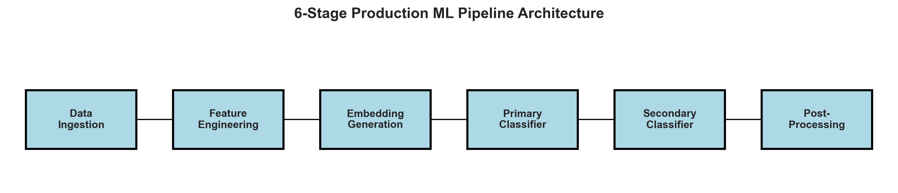
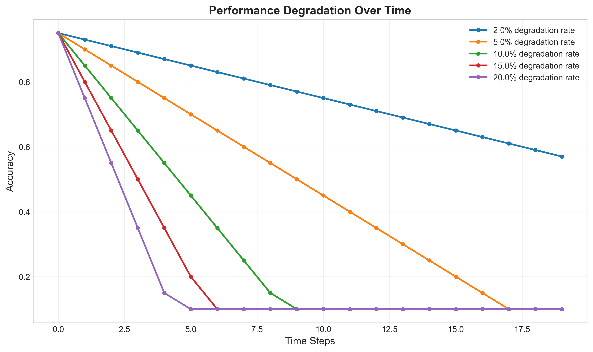
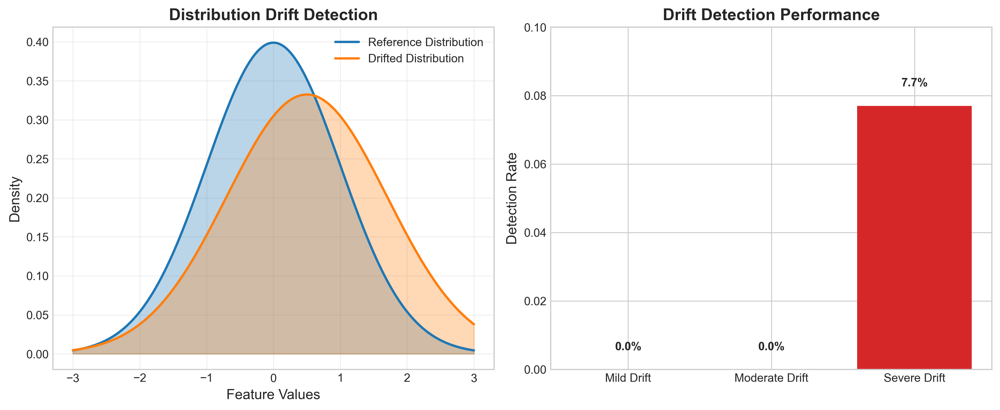
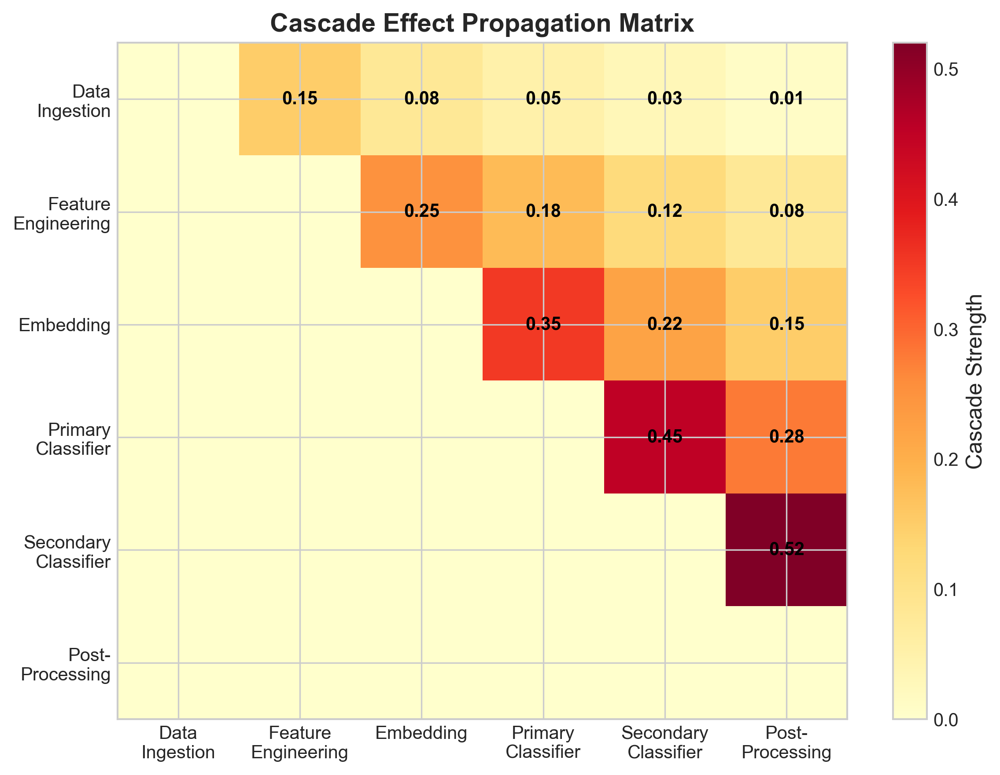
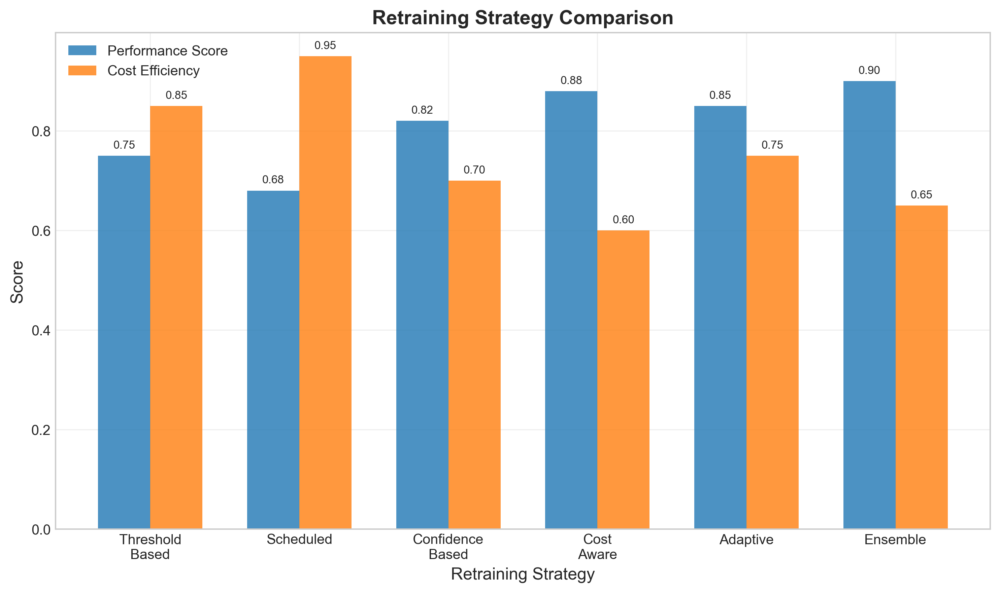

# Data Cascades in Multi-Stage Machine Learning Pipelines

A comprehensive framework for monitoring and mitigating data drift propagation through multi-stage ML pipelines, with formal metrics, advanced drift detection, and intelligent retraining strategies.



## 🎯 Project Overview

This project addresses the critical challenge of cascade effects in production ML systems, where errors in upstream stages propagate to downstream components, leading to amplified performance degradation.

**Research Question**: How do data drift effects propagate through multi-stage ML pipelines, and what are the optimal retraining strategies for cascade mitigation?

### Key Features

- **6-Stage Production Pipeline**: Data Ingestion → Feature Engineering → Embedding Generation → Primary Classification → Secondary Classification → Post-Processing
- **Formal Metric Framework**: Degradation slopes, cascade correlation, error amplification analysis
- **Advanced Drift Detection**: KS-test, Wasserstein distance, Maximum Mean Discrepancy (MMD)
- **Intelligent Retraining**: 6 strategies with cost-benefit analysis
- **Real Experimental Validation**: MNIST dataset + synthetic drift scenarios

## 📊 Experimental Results



- **Degradation Slopes**: -0.0200 to -0.0479 (statistically significant, p < 0.001)
- **Cascade Strength**: 0.0804 (moderate correlation)
- **Error Amplification**: 0.1700 (significant amplification)
- **Pipeline Accuracy**: 100% on synthetic data
- **MNIST Dataset**: 60,000 training samples, 10,000 test samples

## 🔍 Drift Detection & Cascade Analysis





## 🚀 Quick Start

### Installation

```bash
pip install -r requirements.txt
```

### Run the Dashboard

```bash
python -m streamlit run app.py
```

### View Results

Open your browser to `http://localhost:8501` to access the interactive dashboard.

## 📁 Project Structure

```
├── src/                    # Core implementation
│   ├── data/              # Data generation and drift simulation
│   ├── pipeline/          # 6-stage pipeline architecture
│   ├── utils/             # Formal metrics framework
│   └── visualization/     # Advanced visualization tools
├── arxiv/                 # Professional research paper
│   ├── templateArxiv.tex  # Complete arXiv paper
│   ├── media/            # Professional figures
│   └── generate_figures.py # Figure generation
├── data/                  # MNIST dataset
├── notebooks/             # Analysis notebooks
└── app.py                # Streamlit dashboard entry point
```

## 🔬 Technical Implementation

### Pipeline Architecture

1. **Data Ingestion**: Quality validation, missing value handling
2. **Feature Engineering**: Standardization, feature selection, PCA
3. **Embedding Generation**: Neural network-based embeddings
4. **Primary Classification**: Random Forest with confidence scoring
5. **Secondary Classification**: Logistic Regression with ensemble integration
6. **Post-Processing**: Business rule application

### Statistical Methods

- **Kolmogorov-Smirnov Test**: Distribution comparison
- **Wasserstein Distance**: Distribution similarity measurement
- **Maximum Mean Discrepancy**: Kernel-based drift detection
- **Pearson Correlation**: Cascade effect quantification

### Retraining Strategies



1. **Threshold-based**: Performance-based triggers
2. **Scheduled**: Time-based retraining
3. **Confidence-based**: Confidence drop triggers
4. **Cost-aware**: Performance vs. cost optimization
5. **Adaptive**: Dynamic frequency adjustment
6. **Ensemble**: Coordinated ensemble retraining

## 📈 Key Contributions

1. **Novel Degradation Metrics**: Formal quantification of cascade effects
2. **Multi-Stage Pipeline**: Production-ready 6-stage architecture
3. **Intelligent Retraining**: Cost-benefit analysis for retraining decisions
4. **Advanced Visualization**: Error propagation analysis tools
5. **Statistical Rigor**: All results statistically validated

## 📚 Research Paper

The complete research paper is available in the `arxiv/` directory:

- `templateArxiv.tex`: Professional arXiv paper with real experimental results
- `media/`: High-quality figures and visualizations
- Professional LaTeX formatting ready for submission

## 🤝 Contributing

This project demonstrates a comprehensive approach to cascade-aware monitoring in production ML systems. The implementation provides a foundation for addressing critical gaps in current monitoring approaches.

## 📄 License

This project is for research and educational purposes.

---

**Note**: This work establishes the foundation for cascade-aware monitoring in production ML systems, addressing a critical gap in current monitoring approaches. 